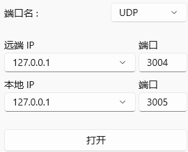

# 抑郁状态分析诊断系统

本项目基于MetaBCI平台开发，主要新增了听觉oddball和情绪stroop两个刺激范式，以及增加了对FBCNet网络的适配。

## 目录

- [安装指南](#安装指南)
- [使用方法](#使用方法)
- [许可证](#许可证)

## 文件结构
```
MetaBCI
    ├─.github
    │  └─workflows
    ├─.idea
    │  └─inspectionProfiles
    ├─demos
    │  ├─brainflow_demos
    │  │  └─__pycache__
    │  ├─brainstim_demos
    │  └─checkpoints
    │      ├─1841207575504
    │      ├─2291187830592
    │      ├─2352513290304
    │      ├─2395914360624
    │      └─2673000058944
    ├─docs
    │  └─source
    │      └─python_apis
    ├─images
    ├─metabci
    │  ├─brainda
    │  │  ├─algorithms
    │  │  │  ├─decomposition
    │  │  │  │  └─__pycache__
    │  │  │  ├─deep_learning
    │  │  │  │  └─__pycache__
    │  │  │  ├─feature_analysis
    │  │  │  │  └─__pycache__
    │  │  │  ├─manifold
    │  │  │  ├─transfer_learning
    │  │  │  ├─utils
    │  │  │  │  └─__pycache__
    │  │  │  └─__pycache__
    │  │  ├─datasets
    │  │  │  └─__pycache__
    │  │  ├─paradigms
    │  │  │  └─__pycache__
    │  │  ├─utils
    │  │  │  └─__pycache__
    │  │  └─__pycache__
    │  ├─brainflow
    │  ├─brainstim
    │  │  ├─textures
    │  │  └─__pycache__
    │  └─__pycache__
    ├─metabci.egg-info
    ├─oddball
    │  ├─MonoBleedingEdge
    │  │  ├─EmbedRuntime
    │  │  └─etc
    │  │      └─mono
    │  │          ├─2.0
    │  │          │  └─Browsers
    │  │          ├─4.0
    │  │          │  └─Browsers
    │  │          ├─4.5
    │  │          │  └─Browsers
    │  │          └─mconfig
    │  └─oddball_Data
    │      ├─Managed
    │      └─Resources
    ├─stroop
    │  ├─MonoBleedingEdge
    │  │  ├─EmbedRuntime
    │  │  └─etc
    │  │      └─mono
    │  │          ├─2.0
    │  │          │  └─Browsers
    │  │          ├─4.0
    │  │          │  └─Browsers
    │  │          ├─4.5
    │  │          │  └─Browsers
    │  │          └─mconfig
    │  └─stroop_Data
    │      ├─Managed
    │      └─Resources
    │      ├─Managed
    │      └─Resources
    └─tests
```

## 安装指南

### 克隆仓库

```sh
git clone https://github.com/capitalwater/MetaBCI-dep.git
```

### 切换目录
```sh
cd your-repo
```
### 安装依赖

```sh
pip install -r requirements.txt 
```
### 安装项目

```sh
pip install -e .
```

## 使用方法
### oddball实验范式
打开demos/brainstim_demos/oddball.py，刺激程序开始运行，点击空格键，实验正式开始。  

实验前可打开串口调试助手,查看刺激范式发送的信息。任意时刻按下esc键退出。


### stroop实验范式
打开demos/brainstim_demosstroop.py，刺激程序开始运行，点击空格键，实验正式开始。  
图片为开心时按键盘左键，图片为悲伤时按键盘左键。  
实验前可打开串口调试助手,查看刺激范式发送的信息。任意时刻按下esc键退出。
### FBCNet算法适配
打开demos/FBCNet.py，程序开始运行，结束时输出准确率。

## 许可证

该项目使用 [MIT 许可证](https://opensource.org/licenses/MIT) 进行授权。许可证的详细内容请参见 [LICENSE](LICENSE) 文件。